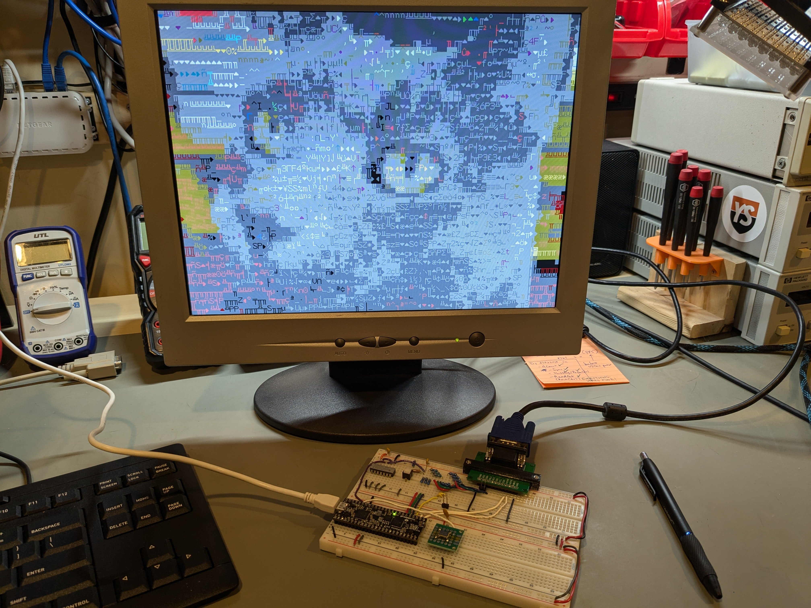

# FPGA VGA text display

This is a companion project to the [HW\_VGA](https://github.com/daveho/HW_VGA) project.
Its goal is to implement an 80x30 text display using 640x480 VGA, using more or less
the same approach as the HW\_VGA project, but using a
[Lattice UP5K FPGA](https://www.latticesemi.com/en/Products/FPGAandCPLD/iCE40UltraPlus)
on an [Upduino 3.1](https://tinyvision.ai/products/upduino-v3-1) (or 3.0) board
rather than discrete logic, GALs, and dual port static RAM.

As of December 2025, the design is fully working. I made a video about it:
<https://youtu.be/PG1XWQCylTA>.

The [Schematic](Schematic) directory has a KiCad schematic, and the
[Logic](Logic) directory has the Verilog code for the FPGA. I use
[APIO](https://github.com/FPGAwars/apio) as the front end for the FPGA tools (see my
[blog post about using the Upduino 3 on Linux](https://daveho.github.io/2021/02/07/upduino3-getting-started-on-linux.html)
for details on setting things up.)

Acknowledgment: a viewer of one of my youtube videos recommended
[John Winans's youtube channel](https://www.youtube.com/channel/UCik0xMsb7kSpPUvT2JoJQ1w)
as a good starting point for learning about FPGA development.
His [introduction to simulation](https://youtu.be/xZhl64vHJ-E)
and [his Verilog examples repo](https://github.com/johnwinans/Verilog-Examples) were
incredibly helpful. By applying the techniques covered in the simulation video, I
basically went from having no idea how to simulate designs to being able to write
some halfway-reasonable testbenches in a day or two. Thank you, John!

## Updates

**27-Dec-2025**: A [Youtube video](https://youtu.be/PG1XWQCylTA) about the
project has been posted.

**25-Nov-2025**: the entire design, including a bidirectional
interface to allow the host system to write to and read from VRAM,
appears to be fully working. Video coming soon. Stay tuned!

**20-Nov-2025**: In my previous thoughts about using mirrored VRAM
banks, I had forgotten that I was using 4 KB of block RAM to store
the VGA font. So, the revised plan is mirrored
[5 KB banks](https://github.com/daveho/FPGA_VGA/blob/90469b43ef998fe6521666e1b50f645583a588a4/Logic/vram_5kb.v)
of VRAM.  With the 4 KB of block RAM used for the font, this means
that we're using 2×5 + 4 = 14 KB, which is just under the 15 KB of
block RAM that the Upduino 3's UP5K FPGA has available.

**17-Nov-2025**: Reading an article on Hacker News about an
[FPGA implementation of the IBM PC-XT](https://bit-hack.net/2025/11/10/fpga-based-ibm-pc-xt/)
gave me a really good idea about how to work around the single
read port on the ICE40 Block RAM. The idea is to use two separate
memory banks for the VRAM. Writes from the host system
go to both banks in parallel, so their contents are always identical.
The display rasterization hardware reads from one bank, and the
host system (when it wants to read from VRAM) reads from the other
bank. This would allow for VRAM with one write port and two
fully-independent read ports. One minor difficulty is that the
UP5K device on the Upduino 3 has only 15 KB of VRAM, whereas the
current design uses 8 KB for VRAM. The 80x30 character display
needs only 4800 bytes, so reducing the VRAM to 6 KB would be sufficient.
A 6 KB VRAM bank could be implemented as a 4 KB lower bank and a
2 KB upper bank, mapped into an 8 KB address space with the upper
2 KB bank mirrored twice in the upper 4 KB of addresses. This wouldn't
cause any problems in practice. I'm planning to work on this soon
(maybe over Thanksgiving.)

**8-Aug-2024**: the block RAM in the ICE40 UP5K FPGA used in the
Upduino 3.0/3.1 is not true dual port memory, which will make the host interface
implementation a bit more complicated than I originally envisioned,
since the pixel generator and the host interface will need to share
the single hardware read port to the video memory. So, it may be a while
before I get this working.
